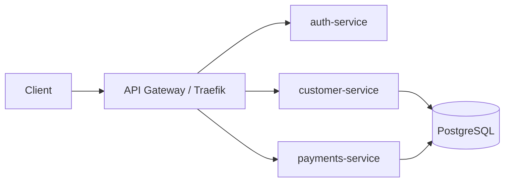

```mermaid
flowchart LR
    Client --> Gateway[API Gateway / Traefik]
    Gateway --> Auth[auth-service]
    Gateway --> Customers[customer-service]
    Gateway --> Payments[payments-service]
    Customers --> DB[(PostgreSQL)]
    Payments --> DB[(PostgreSQL)]
```